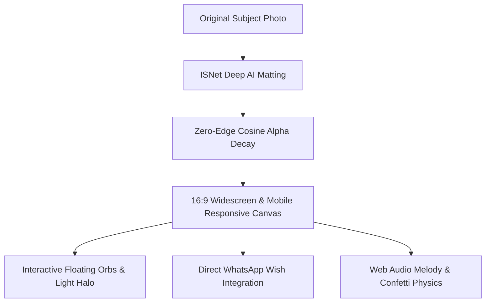

<div align="center">

# 🎈 Happy Birthday Jiya | Widescreen & Mobile Experience

### A Premier 16:9 Widescreen & Mobile Birthday Celebration Web Application

[](https://developer.mozilla.org/en-US/docs/Web/HTML)
[](https://developer.mozilla.org/en-US/docs/Web/CSS)
[](https://developer.mozilla.org/en-US/docs/Web/JavaScript)
[](https://mohitraj8503.github.io/Supv-bday/)

**Happy Birthday Jiya** is a custom, high-fidelity 16:9 widescreen and mobile-optimized birthday web application built with AI background matting, glassmorphism UI, interactive audio synthesis, direct WhatsApp wish routing, and real-time confetti physics.

[Live Demo](https://mohitraj8503.github.io/Supv-bday/) • [Key Features](#-key-features) • [Tech Architecture](#-technology-stack) • [GitHub Pages Deployment](#-github-pages-deployment)

---

</div>

## ✨ End-to-End Experience Architecture

The application combines high-performance frontend animations with deep AI background extraction for a seamless experience across desktop monitors and mobile smartphones.



---

## 🚀 Key Features

* 🖼️ **AI Deep Background Matting**: Uses the ISNet neural segmentation model with zero-edge cosine alpha decay to cleanly extract the portrait with zero white halos or hair artifacts.
* 📺 **16:9 Full-Bleed Widescreen**: Designed to fill 100% of desktop viewports in standard 16:9 ratio (`100vw x 100vh`) with soft ambient light halos and glassmorphism cards.
* 📱 **Mobile Smartphone First**: Fully responsive layout tailored for phone users (`< 768px`) with smooth touch scrolling, centered subject showcase, and full-width touch targets.
* 🎈 **Festive Asset Integration**: Includes interactive 3D birthday cake (`cake.svg`), hanging bunting garland (`banner.png`), and balloon border overlay (`Balloon-Border.png`).
* 📲 **Direct WhatsApp Wish Routing**: Visitors can write custom wishes in the "Send a Wish" modal, which directly opens WhatsApp pre-filled for `+91 86769 92907`.
* 🎵 **Audio Synthesis & Confetti**: Integrates background music playback (`music.mp3`) with Web Audio API fallback synthesizer and real-time canvas confetti explosions.

---

## 🛠️ Technology Stack

| Layer | Technology | Description |
| :--- | :--- | :--- |
| **Frontend Core** | HTML5 / JavaScript (ES6+) | Semantic layout and modular interactive event handlers |
| **Styling & Motion** | Vanilla CSS3 / Glassmorphism | Custom CSS tokens, fluid typography (`clamp()`), and GPU-accelerated keyframe animations |
| **Image AI Processing** | Python 3 / `rembg` (ISNet) / PIL | Deep neural net matting with cosine alpha edge blending |
| **Audio Engine** | Web Audio API / HTML5 Audio | Dual background music player with live equalizer bar animation |
| **Effects & Physics** | `canvas-confetti` Library | Particle explosion physics on page load, cake clicks, and wish submissions |

---

## 🌐 GitHub Pages Deployment

To deploy this project to GitHub Pages:

1. **Set Up Remote Repository**:
   ```bash
   git remote add origin https://github.com/mohitraj8503/Supv-bday.git
   git branch -M main
   git push -u origin main --force
   ```

2. **Enable GitHub Pages**:
   - Go to [mohitraj8503/Supv-bday Settings](https://github.com/mohitraj8503/Supv-bday/settings/pages).
   - Under **Build and deployment** -> **Source**, select **Deploy from a branch**.
   - Choose Branch: `main` and Folder: `/ (root)`.
   - Click **Save**.

Your birthday website will be live at: **[https://mohitraj8503.github.io/Supv-bday/](https://mohitraj8503.github.io/Supv-bday/)** 🎉
